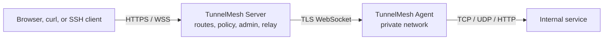

# TunnelMesh

[](https://github.com/nnworld/TunnelMesh/releases)
[](https://github.com/nnworld/TunnelMesh/actions/workflows/ci.yml)
[](https://go.dev/)
[](docs/deployment/binary-release.md)
[](LICENSE)

**English** | [简体中文](README.zh-CN.md)

**Self-hosted tunnels with a real control plane.**

Put an Agent inside a private network, expose managed HTTP routes or local forwards, and operate everything
from a built-in admin console with RBAC, scoped service tokens, Agent policy, audit logs, and observability.
Public ingress is HTTP/HTTPS/WSS only — the Server never listens for public UDP.

[Quick start](docs/user-guide/quickstart.md) · [Architecture](docs/architecture/overview.md) ·
[Docker](docs/deployment/docker.md) · [Security](SECURITY.md) · [中文文档](README.zh-CN.md)

## Why TunnelMesh

| Capability | TunnelMesh | Generic reverse tunnel | Mesh VPN | Managed edge tunnel |
| --- | --- | --- | --- | --- |
| Self-hosted control plane | Yes | Varies | Yes | No |
| Built-in admin console | Yes | Rare | Rare | Yes |
| Scoped service tokens | Yes | Rare | Varies | Managed |
| Browser SSH/SFTP | Yes | No | No | Varies |
| Cluster relay and observability | Yes | Limited | Varies | Managed |

The table describes common deployment patterns, not every product. Choose TunnelMesh when you need a
self-hosted control plane and explicit access policy rather than only a point-to-point tunnel.

## Visual proof


> Detailed user, deployment, operations, and protocol documentation is maintained in Chinese under
> [docs/README.md](docs/README.md).

## Contents

- [Components](#components)
- [Feature highlights](#feature-highlights)
- [Architecture](#architecture)
- [Quick start](#quick-start)
- [Client capabilities](#client-capabilities)
- [Deployment](#deployment)
- [Documentation](#documentation)
- [Development](#development)
- [Releases](#releases)
- [Security model](#security-model)
- [Repository layout](#repository-layout)
- [Project rules](#project-rules)

## Components

| Binary | Runs on | Responsibility | Guide |
| --- | --- | --- | --- |
| `tunnelmesh-server` | Public edge | Management API (`/api/v1`), embedded admin console, HTTP/HTTPS/WSS ingress, route resolution, tunnel coordination, inter-node relay | [Server admin](docs/user-guide/server-admin.md) |
| `tunnelmesh-agent` | Private network or target host | Outbound TLS WebSocket to the Server, dials internal TCP/UDP/HTTP targets, reports allowlisted metadata | [Agent](docs/user-guide/agent.md) |
| `tunnelmesh-client` | User workstation | Local forwards (TCP/UDP/HTTP/SOCKS5/HTTP proxy), route publishing, stdio TCP proxy for SSH | [Client](docs/user-guide/client.md) |

## Feature highlights

**Tunnels and forwarding**

- `forward tcp|udp|http` — a local port reaches an internal service; UDP preserves datagram boundaries and per-source associations.
- `forward socks5` and `forward http-proxy` — browse or proxy into the internal network from a local proxy endpoint.
- Managed HTTP proxy entry — set `https://tp-<name>.<domain>` as a browser or OS proxy; the egress agent, Basic auth and source ACL are configured in the admin console, and nothing has to be installed on the user machine.
- `run` — starts every configured entry point in one process over a per-Agent WebSocket connection pool.

**Publishing and ingress**

- `publish http` — exposes an internal service through a managed explicit route or wildcard domain, with HTTPS and WebSocket upgrade.
- TCP-over-WebSocket bridge (`/ws/tcp`) carries raw TCP for `ssh -o ProxyCommand` and `websocat`.

**Browser SSH/SFTP (WebSSH)**

- Terminal and SFTP file browser inside the admin console; SSH authentication happens in the browser, the Server only relays encrypted bytes over a one-time ticket.
- Host-key SHA-256 fingerprint confirmation, ZMODEM `rz`/`sz` transfers, and three-tier backpressure for large files.
- Optional encrypted-at-rest credentials (AES-256-GCM) enable one-click authentication without echoing secrets.

**Control plane**

- Vue 3 + Element Plus admin console with i18n, RBAC roles, scoped service tokens, Agent policy, cursor-paginated APIs, and a structured audit log.
- Sensitive operations (token reveal, logical traceroute with internal details) require explicit confirmation headers and are audited.

**Scale and availability**

- Stateless Servers: SQLite for local mode, MySQL for cluster mode, with MySQL lease or etcd registration and epoch fencing.
- Inter-node relay over mTLS (or plaintext inside a controlled network), stream flow control, GOAWAY/drain, idempotency keys, and a bounded-staleness authorization cache.

**Observability and diagnostics**

- Prometheus metrics, `/health/live`, `/health/ready`, a bundled Grafana dashboard, alert and recording rules, and W3C `traceparent` propagation.
- Logical traceroute across Client → Server → Agent → target, plus TCP/HTTP/UDP network probes.

## Architecture



Server nodes in cluster mode additionally talk to each other over an authenticated relay
(mTLS by default) so a Client attached to any node can reach an Agent attached to another.
Requests always follow Handler → Service → Repository; the database is the only authoritative
source for management data. See [architecture overview](docs/architecture/overview.md) and
[cluster architecture](docs/architecture/cluster.md).

## Quick start

### Install

For Linux or macOS, download the installer, review it, and install a checksum-verified release:

```sh
curl --fail --silent --show-error --location \
  https://raw.githubusercontent.com/nnworld/TunnelMesh/main/scripts/install.sh \
  --output /tmp/tunnelmesh-install.sh
less /tmp/tunnelmesh-install.sh
bash /tmp/tunnelmesh-install.sh --version v1.1.0
```

The default install directory is `~/.local/bin`; use `--install-dir /usr/local/bin` for a system-wide
install. Without `--version`, the installer resolves and installs the latest stable release. To register
systemd or launchd services, use the platform installer included in the
[release archive](https://github.com/nnworld/TunnelMesh/releases) or the deployment guides.

Download a prebuilt archive for Linux, macOS, or Windows from
[GitHub Releases](https://github.com/nnworld/TunnelMesh/releases), or build from source
(Go 1.23+, Node.js 22):

```sh
git clone https://github.com/nnworld/TunnelMesh.git
cd TunnelMesh
cd web && npm ci && npm run build && cd ..   # generates the embedded admin console
make build                                   # builds ./cmd/... into the three binaries
```

`internal/server/web_dist/` is generated, not committed, and `npm run build` syncs it. Without
that directory `go build ./cmd/...` fails on `//go:embed all:web_dist`. Container builds do the
SPA step inside the Dockerfile, so no manual step is needed there.

### 1. Start the Server (local mode, SQLite)

```yaml
# server.yaml
mode: local
storage:
  driver: sqlite
  auto_init: true
  sqlite:
    path: ./tunnelmesh.db
server:
  http_addr: 127.0.0.1:8080
  dynamic_suffix: apps.example.com
```

```sh
tunnelmesh-server --config server.yaml check-config
tunnelmesh-server --config server.yaml admin bootstrap   # prints the one-time admin password
tunnelmesh-server --config server.yaml run
```

Open the console at `http://127.0.0.1:8080/` and sign in with the bootstrap credentials. If the
output is lost, recover with `tunnelmesh-server --config server.yaml admin regenerate-credentials --confirm`.
Production deployments should terminate TLS in Nginx and set `security.allowed_hosts` /
`security.allowed_origins`.

### 2. Connect an Agent

Create the Agent and a scoped connection token in the console, then run it on the internal host:

```sh
export TUNNELMESH_AGENT_TOKEN=<token from the console>
tunnelmesh-agent --config agent.yaml check-config
tunnelmesh-agent --config agent.yaml run
```

```yaml
# agent.yaml
mode: local
agent:
  id: agent-01
  server_url: ws://127.0.0.1:8080/ws/agent   # wss://tunnel.example.com/ws/agent in production
```

Agents only read metadata from explicit `file` or `env` allowlist entries and never execute
arbitrary commands. Target hosts, ports, and CIDRs are constrained by Server-side Agent policy
and re-validated on the Agent before every dial.

### 3. Forward or publish

```sh
export TUNNELMESH_CLIENT_SERVER_URL=ws://127.0.0.1:8080/ws/client
export TUNNELMESH_CLIENT_TOKEN=<client token from the console>

# local port -> internal service
tunnelmesh-client forward tcp --listen 127.0.0.1:15432 \
  --agent agent-01 --target-host db.internal --target-port 5432

# raw TCP over stdin/stdout, for ssh ProxyCommand and websocat
tunnelmesh-client proxy tcp --agent agent-01 --target-host ssh.internal --target-port 22
```

Managed HTTP routes (explicit or wildcard domains) are created in the console and are covered by
[managed HTTP routes](docs/user-guide/managed-http-route.md) and
[SSH over WebSocket](docs/user-guide/tcp-over-websocket-ssh.md).

### Docker

```sh
docker compose -f docker-compose.local.yml up --build      # Server, SQLite
docker compose -f docker-compose.local.yml --profile agent up -d agent  # after creating an Agent token
docker compose -f docker-compose.cluster.yml up --build    # two Servers + MySQL
make docker-build                                          # three tagged images
```

## Client capabilities

| Command | Protocol | Direction | Notes |
| --- | --- | --- | --- |
| `forward tcp` | TCP | local listen → internal service | ordered byte stream |
| `forward udp` | UDP | local listen → internal service | datagram boundaries, per-source association |
| `forward http` | HTTP | local listen → internal HTTP service | includes WebSocket upgrade |
| `forward socks5` | SOCKS5 CONNECT | local listen → internal services | `--auth password`, `--allow-remote`, optional remote validation URL |
| `forward http-proxy` | HTTP proxy | local listen → internal services | standard forward-proxy entry point |
| `publish http` | HTTP/HTTPS/WS | Server public ingress → internal service | managed or wildcard route |
| `proxy tcp` | TCP | stdin/stdout ↔ internal service | `ssh -o ProxyCommand`, `websocat` |
| `run` | all of the above | configured entry points | one process, per-Agent connection pool |
| `status` / `stop` / `tunnel status` / `tunnel stop` | — | local control | inspect or stop configured tunnels |

Public UDP is not supported: UDP only flows from the user side into the internal network through
`forward udp`. Full flag reference: [client usage](docs/user-guide/client.md).

## Deployment

| Mode | Storage | Registry | Use case |
| --- | --- | --- | --- |
| `local` | SQLite | — | single node, evaluation, small deployments |
| `cluster` | MySQL | MySQL lease (default) or etcd | horizontally scaled, multi-node relay |

- Containers: [Docker deployment](docs/deployment/docker.md), [docker-compose.local.yml](docker-compose.local.yml), [docker-compose.cluster.yml](docker-compose.cluster.yml)
- Services: [systemd](docs/deployment/linux-systemd.md), [launchd](docs/deployment/macos-launchd.md), [Windows Service](docs/deployment/windows-service.md)
- Edge: [Nginx/WSS reverse proxy](docs/deployment/nginx.md), [OpenResty tp-* proxy entry](docs/deployment/openresty-proxy-entry.md), [frontend build and hosting](docs/deployment/frontend.md)
- Cluster: [relay mTLS certificates](docs/operations/relay-mtls.md), [Agent connection pool](docs/operations/connection-pool.md)
- Monitoring: [observability and Grafana](docs/operations/observability.md); Prometheus config, rules, and the Grafana dashboard ship in [deploy/](deploy/README.md)

## Documentation

Full index: [docs/README.md](docs/README.md).

**English entry points**

- [English documentation index](docs/en/README.md)
- [Production deployment](docs/en/deployment/production.md)
- [Security hardening](docs/en/operations/security.md)
- [Agent guide](docs/en/user-guide/agent.md)
- [Client guide](docs/en/user-guide/client.md)
- [Server administration](docs/en/user-guide/server-admin.md)

**User guides**

- [Client usage](docs/user-guide/client.md) — forwards, SOCKS5, publishing, `proxy tcp`
- [Agent usage](docs/user-guide/agent.md) — registration, connection pool, metadata allowlist
- [Server admin console](docs/user-guide/server-admin.md) — Agents, routes, tokens, audit, WebSSH/SFTP, releases
- [Managed HTTP routes](docs/user-guide/managed-http-route.md) — explicit and wildcard domains, HTTPS
- [HTTP proxy entry](docs/user-guide/http-proxy-entry.md) — browser/OS proxy without installing the client
- [SSH over WebSocket](docs/user-guide/tcp-over-websocket-ssh.md) — `ProxyCommand` and `websocat`

**Operations**

- [Configuration reference](docs/operations/configuration.md), [Server/Agent/Client examples](docs/operations/config-examples.md), [client protocol and pool examples](docs/operations/client-configuration-examples.md)
- [Schema upgrades and rollback](docs/operations/schema-upgrades.md), migrations in [migrations](migrations)
- [Logging](docs/operations/logging.md), [network probes](docs/operations/network-probes.md), [SLO](docs/operations/slo.md), [capacity and load tests](docs/operations/capacity.md)
- [Troubleshooting](docs/operations/troubleshooting.md), [completeness checklist](docs/operations/completeness-checklist.md)

**Architecture and protocol**

- [Architecture overview](docs/architecture/overview.md), [cluster architecture](docs/architecture/cluster.md), [ADR index](docs/architecture/adr/README.md)
- [WebSocket protocol](docs/protocol/websocket.md), [proxy protocol modules](docs/protocol/proxy-modules.md)
- [OpenAPI](docs/api/openapi.yaml)

**Development and change records**

- [Contributing](CONTRIBUTING.md), [development docs](docs/development/README.md), [testing and verification](docs/development/testing.md), [documentation conventions](docs/development/documentation.md)
- [Implementation plan index](docs/superpowers/plans/README.md), [design spec index](docs/superpowers/specs/README.md), [PR record index](docs/pull-requests/README.md)

## Development

Prerequisites: Go 1.23+, Node.js 22 + npm for `web/`, Docker for image builds, and Chrome plus
`lrzsz` for the WebSSH end-to-end test. Contribution workflow: [CONTRIBUTING.md](CONTRIBUTING.md).

| Task | Command |
| --- | --- |
| Build binaries | `make build` |
| Unit and integration tests | `make test` (`go test ./...`) |
| Race detector | `make race` (`go test -race ./...`) |
| Static analysis | `make lint` (`go vet ./...`) |
| Admin console | `make web-build` (`cd web && npm run build`) |
| Container images | `make docker-build` |
| Release archives | `make release VERSION=v1.2.3` |

Verification expected before a pull request:

```sh
go test ./... -count=1
go test -race ./... -timeout 30m     # internal/server needs more than the default 10m package timeout
go vet ./...
git diff --check
cd web && npm test -- --run && npm run build
./scripts/verify-web-embed.sh        # embedded assets match web/dist
node test/e2e/webssh/run.mjs         # browser E2E, see test/e2e/webssh/README.md
```

Work follows TDD: a failing test first, then the minimal implementation. Non-trivial features,
interface changes, schema changes, and cross-module refactors need an implementation plan in
`docs/superpowers/plans/` and a PR record in `docs/pull-requests/` before merging. Rationale for
each check, including the `-race` timeout and the embedded-asset verification, is documented in
[testing and verification](docs/development/testing.md).

## Releases

Prebuilt Linux, macOS, and Windows archives (amd64 and arm64) are published to
[GitHub Releases](https://github.com/nnworld/TunnelMesh/releases). Every release includes all three
binaries, platform service templates, `SHA256SUMS`, and a `manifest.json` carrying the current
Schema version. Tags use immutable `vMAJOR.MINOR.PATCH` versions; mutable major or minor tags are
not published. Packaging details: [binary release](docs/deployment/binary-release.md).

Build the three container variants locally with:

```sh
docker build --build-arg APP=server -t tunnelmesh:server .
docker build --build-arg APP=agent -t tunnelmesh:agent .
docker build --build-arg APP=client -t tunnelmesh:client .
```

## Security model

- Passwords use Argon2id; service tokens are stored as hashes, with optional AES-256-GCM ciphertext kept only to satisfy an explicit admin reveal.
- Token reveal requires `X-Token-Reveal-Confirm`, an `Idempotency-Key`, `acknowledgeRisk=true`, returns `Cache-Control: no-store`, and writes an audit record.
- All authorization is enforced server-side; client-supplied owner, Agent, or role values are never trusted.
- Agent metadata comes only from allowlisted files or environment variables; names matching sensitive patterns are cleared and marked `redacted=true`.
- Every target address is re-checked on the Agent for SSRF, loopback, private, link-local, CIDR, and port policy.
- Logs, metrics, audit records, and normal traceroute output never contain secrets, passwords, private keys, full `Authorization` headers, or session bytes.
- Deliberately not implemented: ICMP, TUN/L2 VPN, P2P NAT traversal, and arbitrary remote command execution. SSH support is limited to the existing stdio/WebSocket proxy path.

## Repository layout

| Path | Purpose |
| --- | --- |
| `cmd/` | process entry points for the three binaries |
| `internal/cli/` | flags, config loading, subcommands |
| `internal/config/` | config model, defaults, precedence |
| `internal/auth/` | users, tokens, Argon2id, RBAC, admin recovery |
| `internal/storage/` | database access, DDL bootstrap, migrations, repositories |
| `internal/registry/` | MySQL lease, etcd discovery, epoch fencing |
| `internal/protocol/` | WebSocket frames, capability negotiation, stream state machine, UDP association, traceroute |
| `internal/session/`, `internal/relay/` | sessions, cross-node relay, stream lifecycle |
| `internal/routing/`, `internal/server/` | route resolution, HTTP/WS/TCP ingress, management API |
| `internal/client/`, `internal/agent/` | client forwarding, Agent sessions, internal service dialing |
| `internal/proxy/` | HTTP CONNECT, SOCKS5, PROXY protocol v2 handshake parsing |
| `internal/observability/` | Prometheus metrics, structured events, `traceparent` propagation |
| `internal/metadata/` | shared metadata allowlist contract for Agent and Client |
| `internal/build/` | version, commit, and build-time stamping |
| `internal/e2e/` | in-process Go end-to-end tests across Server, Agent, and Client |
| `migrations/` | full DDL (`ddl.sql`) and immutable incremental upgrade scripts |
| `web/` | Vue 3 + TypeScript admin console; production build is embedded by the Server |
| `deploy/` | ready-to-use artifacts: systemd units, launchd/WinSW templates, installer scripts, Prometheus config and rules, Grafana dashboard; see [deploy/README.md](deploy/README.md) |
| `docs/` | architecture, protocol, deployment, operations, and user documentation |
| `scripts/` | release packaging, embedded-asset verification, relay certificate issuance, doc index generation |
| `test/e2e/` | browser end-to-end tests |

## Project rules

[AGENTS.md](AGENTS.md) is the single source of truth for architecture constraints, layering,
database and migration policy, API conventions, verification requirements, and Git rules;
`CLAUDE.md` is a compatibility pointer to it. Commits are not created automatically: `commit`,
`push`, and `merge` require explicit authorization and a green verification run first.

## License

Apache License 2.0. See [LICENSE](LICENSE) for the full text and [NOTICE](NOTICE) for copyright
and third-party attribution.

Third-party Go modules are declared in [go.mod](go.mod) and admin console packages in
[web/package.json](web/package.json); each remains under its own license. Release archives
produced by `scripts/build-release.sh` always include `LICENSE` and `NOTICE`, and the build fails
if either is missing.
