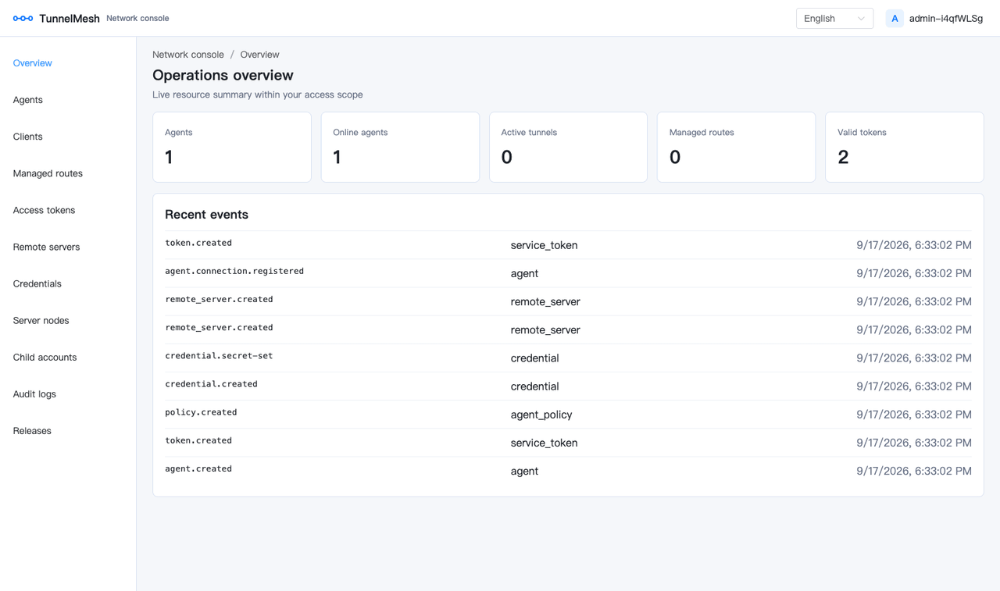
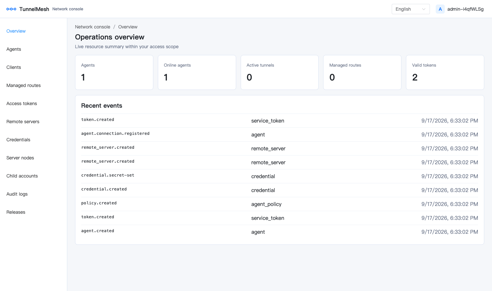
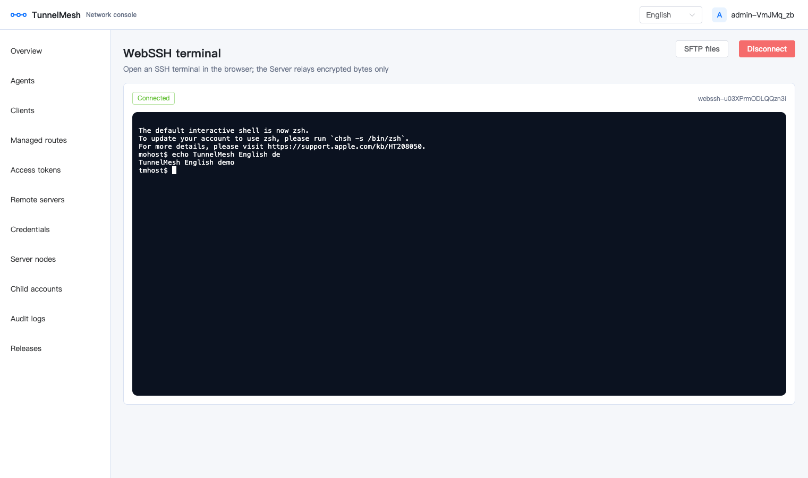
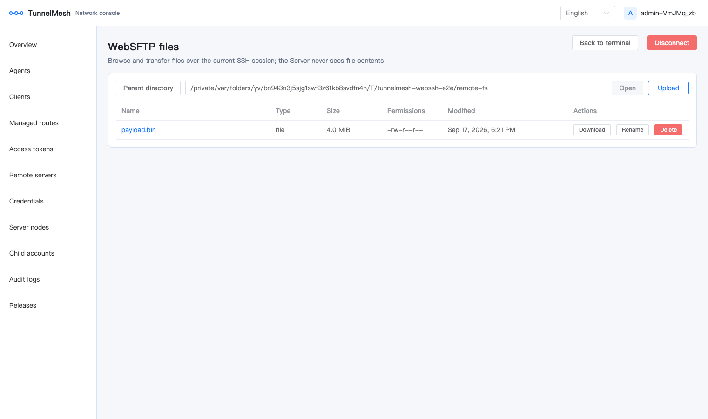
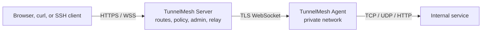

# TunnelMesh

[](https://github.com/nnworld/TunnelMesh/releases)
[](https://github.com/nnworld/TunnelMesh/actions/workflows/ci.yml)
[](https://go.dev/)
[](docs/deployment/binary-release.md)
[](LICENSE)

[English](README.md) | **简体中文**

**带完整控制面的自托管内网穿透平台。**

在内网部署 Agent，通过托管 HTTP 路由或本地端口转发访问内网服务，并在内置管理后台中完成
RBAC、scoped service token、Agent 策略、审计和可观测性管理。公网入口只使用 HTTP/HTTPS/WSS，
Server 不监听公网 UDP。

[五分钟快速开始](docs/user-guide/quickstart.md) · [架构](docs/architecture/overview.md) ·
[Docker](docs/deployment/docker.md) · [安全](SECURITY.md) · [English](README.md)

## 为什么选择 TunnelMesh

| 能力 | TunnelMesh | 通用反向隧道 | Mesh VPN | 托管边缘隧道 |
| --- | --- | --- | --- | --- |
| 自托管控制面 | 有 | 视项目 | 有 | 无 |
| 内置管理后台 | 有 | 少见 | 少见 | 有 |
| Scoped service token | 有 | 少见 | 视项目 | 托管 |
| 浏览器 SSH/SFTP | 有 | 无 | 无 | 视项目 |
| 集群 relay 与可观测性 | 有 | 有限 | 视项目 | 托管 |

上表描述的是常见部署模式，而不是所有产品。当你需要自托管控制面和显式访问策略，而不只是点对点
隧道时，TunnelMesh 更适合。

## 界面演示









> 完整文档索引见 [docs/README.md](docs/README.md)。

## 目录

- [组件](#组件)
- [功能亮点](#功能亮点)
- [架构](#架构)
- [快速开始](#快速开始)
- [客户端能力](#客户端能力)
- [部署形态](#部署形态)
- [文档](#文档)
- [开发](#开发)
- [发行](#发行)
- [安全模型](#安全模型)
- [仓库结构](#仓库结构)
- [项目规范](#项目规范)

## 组件

| 可执行文件 | 部署位置 | 职责 | 文档 |
| --- | --- | --- | --- |
| `tunnelmesh-server` | 公网入口 | 管理 API（`/api/v1`）、内嵌管理后台、HTTP/HTTPS/WSS 入口、路由解析、隧道协调、节点间 relay | [Server 管理后台](docs/user-guide/server-admin.md) |
| `tunnelmesh-agent` | 内网或目标主机 | 主动建立到 Server 的 TLS WebSocket，连接内网 TCP/UDP/HTTP 目标，按 allowlist 上报 metadata | [Agent 使用帮助](docs/user-guide/agent.md) |
| `tunnelmesh-client` | 用户主机 | 本地转发（TCP/UDP/HTTP/SOCKS5/HTTP 代理）、路由发布、面向 SSH 的 stdio TCP 代理 | [Client 使用帮助](docs/user-guide/client.md) |

## 功能亮点

**隧道与转发**

- `forward tcp|udp|http`：本地端口直达内网服务；UDP 保留 datagram 边界并按源地址复用 association。
- `forward socks5`、`forward http-proxy`：通过本地代理入口访问内网服务。
- 托管 HTTP 代理入口：把 `https://tp-<name>.<domain>` 填进浏览器或系统代理即可出网或访问 Agent 内网服务；出口 Agent、Basic 认证与来源 ACL 全部在管理后台配置，用户机器上不需要安装 client。
- `run`：在一个进程内启动配置文件中的全部入口，并按 Agent 建立 WebSocket 连接池。

**发布与公网入口**

- `publish http`：把内网服务发布到托管的显式路由或通配域名，支持 HTTPS 与 WebSocket Upgrade。
- TCP-over-WebSocket bridge（`/ws/tcp`）为 `ssh -o ProxyCommand` 和 `websocat` 承载原始 TCP 字节流。

**浏览器 SSH/SFTP（WebSSH）**

- 管理后台内置终端与 SFTP 文件浏览；SSH 认证在浏览器内完成，Server 只通过一次性 ticket 转发加密字节。
- 连接前必须确认目标主机密钥的 SHA-256 指纹；支持 ZMODEM `rz`/`sz` 收发和大文件三层背压。
- 凭据可选加密存储（AES-256-GCM），实现免密一键登录，且任何接口都不回显秘密。

**控制面**

- Vue 3 + Element Plus 管理后台，支持 i18n、RBAC 角色、scoped service token、Agent 策略、cursor 分页和结构化审计日志。
- 敏感操作（token reveal、带内网明细的逻辑 traceroute）必须携带显式确认头并写入审计。

**扩展与可用性**

- Server 无状态：本地模式用 SQLite，集群模式用 MySQL；注册发现支持 MySQL lease 或 etcd，并用 epoch fencing 隔离陈旧节点。
- 节点间 relay 走 mTLS（受控内网也可用明文），具备流控、GOAWAY/drain、幂等键和有界陈旧的授权缓存。

**可观测性与诊断**

- Prometheus 指标、`/health/live`、`/health/ready`、内置 Grafana Dashboard、告警与录制规则、W3C `traceparent` 透传。
- Client → Server → Agent → 目标的逻辑 traceroute，以及 TCP/HTTP/UDP 全链路网络探针。

## 架构



集群模式下 Server 节点之间还通过带认证的 relay（默认 mTLS）互通，因此连接在任意节点上的 Client
都能访问连接在其他节点上的 Agent。请求始终遵循 Handler → Service → Repository；管理数据只以数据库
为权威来源。详见[架构概览](docs/architecture/overview.md)和[集群架构](docs/architecture/cluster.md)。

## 快速开始

### 安装

从 [GitHub Releases](https://github.com/nnworld/TunnelMesh/releases) 下载 Linux、macOS 或 Windows
预编译包，或从源码构建（Go 1.23+、Node.js 22）：

```sh
git clone https://github.com/nnworld/TunnelMesh.git
cd TunnelMesh
cd web && npm ci && npm run build && cd ..   # 生成内嵌的管理后台产物
make build                                   # 构建 ./cmd/... 三个可执行文件
```

`internal/server/web_dist/` 是构建产物、不入库，由 `npm run build` 同步生成。缺少该目录时
`go build ./cmd/...` 会在 `//go:embed all:web_dist` 处失败。容器构建在 Dockerfile 的多阶段里
自动完成前端构建，无需手工步骤。

### 1. 启动 Server（本地模式，SQLite）

```yaml
# server.yaml
mode: local
storage:
  driver: sqlite
  auto_init: true
  sqlite:
    path: ./tunnelmesh.db
server:
  http_addr: 127.0.0.1:8080
  dynamic_suffix: apps.example.com
```

```sh
tunnelmesh-server --config server.yaml check-config
tunnelmesh-server --config server.yaml admin bootstrap   # 输出一次性管理员密码
tunnelmesh-server --config server.yaml run
```

在浏览器打开 `http://127.0.0.1:8080/`，用 bootstrap 输出的凭据登录。控制台输出丢失时使用
`tunnelmesh-server --config server.yaml admin regenerate-credentials --confirm` 恢复。生产环境
应由 Nginx 终止 TLS，并配置 `security.allowed_hosts` 与 `security.allowed_origins`。

### 2. 连接 Agent

在管理后台创建 Agent 和 scoped 连接 token，然后在内网主机上运行：

```sh
export TUNNELMESH_AGENT_TOKEN=<管理后台生成的 token>
tunnelmesh-agent --config agent.yaml check-config
tunnelmesh-agent --config agent.yaml run
```

```yaml
# agent.yaml
mode: local
agent:
  id: agent-01
  server_url: ws://127.0.0.1:8080/ws/agent   # 生产环境使用 wss://tunnel.example.com/ws/agent
```

Agent 只读取配置中显式列出的 `file` 或 `env` allowlist 项，不执行任意命令。目标主机、端口和
CIDR 由 Server 侧 Agent 策略约束，并在 Agent 每次拨号前再次校验。

### 3. 转发或发布

```sh
export TUNNELMESH_CLIENT_SERVER_URL=ws://127.0.0.1:8080/ws/client
export TUNNELMESH_CLIENT_TOKEN=<管理后台生成的 client token>

# 本地端口 -> 内网服务
tunnelmesh-client forward tcp --listen 127.0.0.1:15432 \
  --agent agent-01 --target-host db.internal --target-port 5432

# stdin/stdout 原始 TCP，用于 ssh ProxyCommand 和 websocat
tunnelmesh-client proxy tcp --agent agent-01 --target-host ssh.internal --target-port 22
```

托管 HTTP 路由（显式域名或通配域名）在管理后台创建，详见[托管 HTTP 路由](docs/user-guide/managed-http-route.md)
和 [SSH over WebSocket](docs/user-guide/tcp-over-websocket-ssh.md)。

### Docker

```sh
docker compose -f docker-compose.local.yml up --build      # Server，SQLite
docker compose -f docker-compose.local.yml --profile agent up -d agent  # 创建 Agent token 后启动
docker compose -f docker-compose.cluster.yml up --build    # 两个 Server + MySQL
make docker-build                                          # 三个镜像
```

## 客户端能力

| 命令 | 协议 | 方向 | 说明 |
| --- | --- | --- | --- |
| `forward tcp` | TCP | 本地监听 → 内网服务 | 有序字节流 |
| `forward udp` | UDP | 本地监听 → 内网服务 | 保留 datagram 边界，按源地址复用 association |
| `forward http` | HTTP | 本地监听 → 内网 HTTP 服务 | 支持 WebSocket Upgrade |
| `forward socks5` | SOCKS5 CONNECT | 本地监听 → 内网服务 | `--auth password`、`--allow-remote`、可选远端校验 URL |
| `forward http-proxy` | HTTP 代理 | 本地监听 → 内网服务 | 标准正向代理入口 |
| `publish http` | HTTP/HTTPS/WS | Server 公网入口 → 内网服务 | 托管路由或通配域名 |
| `proxy tcp` | TCP | stdin/stdout ↔ 内网服务 | `ssh -o ProxyCommand`、`websocat` |
| `run` | 以上全部 | 配置文件中声明的入口 | 单进程，按 Agent 建立连接池 |
| `status` / `stop` / `tunnel status` / `tunnel stop` | — | 本地控制 | 查看或停止已配置的隧道 |

公网不支持 UDP：UDP 只能通过 `forward udp` 从用户侧发起到内网。完整参数见
[Client 使用帮助](docs/user-guide/client.md)。

## 部署形态

| 模式 | 存储 | 注册发现 | 适用场景 |
| --- | --- | --- | --- |
| `local` | SQLite | — | 单节点、试用、小规模部署 |
| `cluster` | MySQL | MySQL lease（默认）或 etcd | 水平扩展、多节点 relay |

- 容器：[Docker 部署](docs/deployment/docker.md)、[docker-compose.local.yml](docker-compose.local.yml)、[docker-compose.cluster.yml](docker-compose.cluster.yml)
- 服务化：[systemd](docs/deployment/linux-systemd.md)、[launchd](docs/deployment/macos-launchd.md)、[Windows Service](docs/deployment/windows-service.md)
- 入口：[Nginx/WSS 反向代理](docs/deployment/nginx.md)、[OpenResty tp-* 代理入口](docs/deployment/openresty-proxy-entry.md)、[前端构建与部署](docs/deployment/frontend.md)
- 集群：[relay mTLS 证书](docs/operations/relay-mtls.md)、[Agent 连接池](docs/operations/connection-pool.md)
- 监控：[可观测性与 Grafana](docs/operations/observability.md)；Prometheus 配置、规则与 Grafana Dashboard 等产物见 [deploy/](deploy/README.md)

## 文档

完整索引：[docs/README.md](docs/README.md)。

**英文入口**

- 简明英文指南：[English documentation](docs/en/README.md)
- 生产部署：[Production deployment](docs/en/deployment/production.md)
- 安全加固：[Security hardening](docs/en/operations/security.md)
- Agent 指南：[Agent guide](docs/en/user-guide/agent.md)
- Client 指南：[Client guide](docs/en/user-guide/client.md)
- Server 管理：[Server administration](docs/en/user-guide/server-admin.md)

**用户指南**

- [Client 使用帮助](docs/user-guide/client.md)：转发、SOCKS5、发布、`proxy tcp`
- [Agent 使用帮助](docs/user-guide/agent.md)：注册、连接池、metadata allowlist
- [Server 管理后台](docs/user-guide/server-admin.md)：Agent、路由、token、审计、WebSSH/SFTP、发行管理
- [托管 HTTP 路由](docs/user-guide/managed-http-route.md)：显式域名与通配域名、HTTPS
- [HTTP 代理入口（tp-*）](docs/user-guide/http-proxy-entry.md)：浏览器/系统代理，免安装 client
- [SSH over WebSocket](docs/user-guide/tcp-over-websocket-ssh.md)：`ProxyCommand` 与 `websocat`

**运维**

- [配置说明](docs/operations/configuration.md)、[三端配置示例](docs/operations/config-examples.md)、[Client 全协议与连接池示例](docs/operations/client-configuration-examples.md)
- [Schema 升级与回滚](docs/operations/schema-upgrades.md)，迁移脚本见 [migrations](migrations)
- [日志](docs/operations/logging.md)、[全链路网络探针](docs/operations/network-probes.md)、[SLO](docs/operations/slo.md)、[容量与压测](docs/operations/capacity.md)
- [故障排查](docs/operations/troubleshooting.md)、[项目完整性清单](docs/operations/completeness-checklist.md)

**架构与协议**

- [架构概览](docs/architecture/overview.md)、[集群架构](docs/architecture/cluster.md)、[ADR 索引](docs/architecture/adr/README.md)
- [WebSocket 协议](docs/protocol/websocket.md)、[代理协议模块](docs/protocol/proxy-modules.md)
- [OpenAPI](docs/api/openapi.yaml)

**开发与变更记录**

- [贡献指南](CONTRIBUTING.md)、[开发文档入口](docs/development/README.md)、[测试与验证](docs/development/testing.md)、[文档规范](docs/development/documentation.md)
- [实施计划索引](docs/superpowers/plans/README.md)、[设计规格索引](docs/superpowers/specs/README.md)、[PR 记录索引](docs/pull-requests/README.md)

## 开发

前置条件：Go 1.23+，`web/` 需要 Node.js 22 与 npm，镜像构建需要 Docker，WebSSH 端到端测试需要
Chrome 与 `lrzsz`。贡献流程见[贡献指南](CONTRIBUTING.md)。

| 任务 | 命令 |
| --- | --- |
| 构建可执行文件 | `make build` |
| 单元与集成测试 | `make test`（`go test ./...`） |
| 竞态检测 | `make race`（`go test -race ./...`） |
| 静态检查 | `make lint`（`go vet ./...`） |
| 管理后台 | `make web-build`（`cd web && npm run build`） |
| 容器镜像 | `make docker-build` |
| 发行归档 | `make release VERSION=v1.2.3` |

提交 PR 前必须完成的验证：

```sh
go test ./... -count=1
go test -race ./... -timeout 30m     # internal/server 超过 Go 默认的 10m 单包超时
go vet ./...
git diff --check
cd web && npm test -- --run && npm run build
./scripts/verify-web-embed.sh        # 校验内嵌产物与 web/dist 一致
node test/e2e/webssh/run.mjs         # 浏览器端到端测试，见 test/e2e/webssh/README.md
```

开发遵循 TDD：先写失败测试，再写最小实现。非平凡功能、接口变更、Schema 变更和跨模块重构必须
先有 `docs/superpowers/plans/` 下的实施计划和 `docs/pull-requests/` 下的 PR 记录。每项验证的
成本与成因（包括 `-race` 超时和嵌入产物校验）见[测试与验证](docs/development/testing.md)。

## 发行

Linux、macOS、Windows（amd64 与 arm64）预编译归档发布在
[GitHub Releases](https://github.com/nnworld/TunnelMesh/releases)。每个 Release 都包含三个可执行
文件、各平台服务模板、`SHA256SUMS` 和记录当前 Schema 版本的 `manifest.json`。标签使用不可变的
`vMAJOR.MINOR.PATCH`，不发布可变的 major/minor 标签。打包细节见[跨平台可执行文件打包](docs/deployment/binary-release.md)。

本地构建三个容器镜像：

```sh
docker build --build-arg APP=server -t tunnelmesh:server .
docker build --build-arg APP=agent -t tunnelmesh:agent .
docker build --build-arg APP=client -t tunnelmesh:client .
```

## 安全模型

- 密码使用 Argon2id；service token 以 hash 存储，仅在满足管理员显式 reveal 需求时额外保存 AES-256-GCM 密文。
- token reveal 必须携带 `X-Token-Reveal-Confirm`、`Idempotency-Key` 和 `acknowledgeRisk=true`，响应带 `Cache-Control: no-store` 并写入审计。
- 所有权限校验在服务端完成，绝不信任客户端传入的 owner、Agent 或 role。
- Agent metadata 只来自 allowlist 中的文件或环境变量；名称命中敏感模式时清空值并标记 `redacted=true`。
- 每个目标地址在 Agent 侧再次校验 SSRF、回环、私网、链路本地、CIDR 和端口策略。
- 日志、指标、审计和普通 traceroute 输出不包含 secret、密码、私钥、完整 `Authorization` header 或会话字节。
- 明确不实现：ICMP、TUN/L2 VPN、P2P NAT traversal 和任意远程命令执行。SSH 支持仅限现有 stdio/WebSocket 代理链路。

## 仓库结构

| 路径 | 职责 |
| --- | --- |
| `cmd/` | 三个可执行文件的进程入口 |
| `internal/cli/` | 命令行参数、配置加载、子命令 |
| `internal/config/` | 配置模型、默认值、优先级 |
| `internal/auth/` | 用户、token、Argon2id、RBAC、管理员恢复 |
| `internal/storage/` | 数据库连接、DDL 初始化、版本迁移、Repository 实现 |
| `internal/registry/` | MySQL lease、etcd 注册发现、epoch fencing |
| `internal/protocol/` | WebSocket frame、能力协商、stream 状态机、UDP association、traceroute |
| `internal/session/`、`internal/relay/` | 会话管理、跨节点 relay、流生命周期 |
| `internal/routing/`、`internal/server/` | 路由解析、HTTP/WS/TCP 接入、管理 API |
| `internal/client/`、`internal/agent/` | 客户端转发、Agent 会话、内网服务连接 |
| `internal/proxy/` | HTTP CONNECT、SOCKS5、PROXY protocol v2 握手解析 |
| `internal/observability/` | Prometheus 指标、结构化事件、`traceparent` 传播 |
| `internal/metadata/` | Agent 与 Client 共用的 metadata allowlist 契约 |
| `internal/build/` | 版本、commit 与构建时间信息 |
| `internal/e2e/` | 进程内 Server/Agent/Client 全链路 Go 端到端测试 |
| `migrations/` | 全量 DDL（`ddl.sql`）与不可变的增量升级脚本 |
| `web/` | Vue 3 + TypeScript 管理后台，生产产物由 Server embed |
| `deploy/` | 可直接使用的部署产物：systemd unit、launchd/WinSW 模板、安装脚本、Prometheus 配置与规则、Grafana Dashboard，清单见 [deploy/README.md](deploy/README.md) |
| `docs/` | 架构、协议、部署、运维与用户文档 |
| `scripts/` | 发行打包、内嵌产物校验、relay 证书签发与文档索引生成 |
| `test/e2e/` | 浏览器端到端测试 |

## 项目规范

[AGENTS.md](AGENTS.md) 是架构约束、分层、数据库与迁移策略、API 规范、验证要求和 Git 规范的唯一
权威来源；`CLAUDE.md` 只是指向它的兼容入口。AI 不会自动提交：`commit`、`push`、`merge` 必须先获得
明确授权并完成验证。

## 许可

采用 Apache License 2.0。完整文本见 [LICENSE](LICENSE)，版权与第三方声明见 [NOTICE](NOTICE)。

Go 第三方模块声明在 [go.mod](go.mod)，管理后台依赖声明在 [web/package.json](web/package.json)，
各自仍遵循其原有许可。`scripts/build-release.sh` 产出的每个发行归档都包含 `LICENSE` 与 `NOTICE`，
缺少任一文件时构建直接失败。
