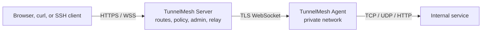

# GitHub Growth Optimization Implementation Plan

> **For agentic workers:** REQUIRED SUB-SKILL: Use superpowers:subagent-driven-development (recommended) or superpowers:executing-plans to implement this plan task-by-task. Steps use checkbox (`- [ ]`) syntax for tracking.

**Goal:** Improve GitHub first-screen conversion and trust signals without changing runtime behavior.

**Architecture:** Keep repository presentation in Markdown and GitHub workflow files. The README becomes a concise bilingual product landing page, while detailed operations remain in `docs/`. CI is split into independent Go, frontend, and packaging jobs so failures remain isolated.

**Tech Stack:** Markdown, Mermaid, GitHub Actions, Go 1.23, Node.js 22, Docker Compose.

**Spec:** `docs/superpowers/specs/2026-09-17-github-growth-optimization-design.md`

## Global Constraints

- Do not change runtime code, protocol behavior, or database schema.
- Do not commit secrets, tokens, private keys, production DSNs, or generated web bundles.
- English and Chinese README sections must remain semantically aligned.
- CI must run on `pull_request` and `push` to `main`.
- Required Go commands are exactly `go test ./... -count=1`, `go test -race ./...`, and `go vet ./...`.
- Required frontend commands are exactly `cd web && npm test -- --run` and `cd web && npm run build`.
- Required embed validation is `./scripts/verify-web-embed.sh`.
- Required Docker validation is `docker compose -f docker-compose.local.yml config`.
- Documentation indexes must be regenerated with `python3 scripts/gen_doc_index.py`.

---

### Task 1: README Landing Page

**Files:**

- Modify: `README.md`
- Modify: `README.zh-CN.md`
- Create: `docs/user-guide/quickstart.md`

**Interfaces:**

- Consumes: Existing links under `docs/user-guide/`, `docs/deployment/`, and `docs/operations/`.
- Produces: A bilingual landing structure and an English five-minute quick start that later tasks can link to.

- [ ] **Step 1: Draft the new first screen**

Use this structure for `README.md`:

```markdown
# TunnelMesh

[badges]

**Self-hosted tunnels with a real control plane.**

Put an Agent inside a private network, expose managed HTTP routes or local forwards, and operate everything from a built-in admin console with RBAC, scoped tokens, policies, audit logs, and observability.

[Quick start](docs/user-guide/quickstart.md) · [Architecture](docs/architecture/overview.md) · [Docker](docs/deployment/docker.md) · [Security](SECURITY.md) · [中文文档](README.zh-CN.md)
```

Use the equivalent Chinese copy in `README.zh-CN.md`.

- [ ] **Step 2: Add the architecture diagram**

Add this Mermaid diagram:



- [ ] **Step 3: Add the comparison table**

Include columns for TunnelMesh, generic reverse tunnels, mesh VPNs, and managed edge tunnels. Compare only these facts:

| Capability | TunnelMesh | Generic reverse tunnel | Mesh VPN | Managed edge tunnel |
| --- | --- | --- | --- | --- |
| Self-hosted control plane | Yes | Varies | Yes | No |
| Built-in admin console | Yes | Rare | Rare | Yes |
| Scoped service tokens | Yes | Rare | Varies | Managed |
| Browser SSH/SFTP | Yes | No | No | Varies |
| Cluster relay and observability | Yes | Limited | Varies | Managed |

Do not claim superiority in areas that depend on deployment size or policy.

- [ ] **Step 4: Write the English quick start**

Create `docs/user-guide/quickstart.md` with these sections:

1. What you will build
2. Prerequisites
3. Start the local stack with Docker
4. Bootstrap the administrator
5. Create an Agent and scoped token
6. Start the Agent
7. Test a local forward
8. Production next steps

The Docker path must use:

```bash
docker compose -f docker-compose.local.yml up -d --build server agent
docker compose -f docker-compose.local.yml exec server /usr/local/bin/tunnelmesh admin bootstrap
```

- [ ] **Step 5: Validate documentation**

Run:

```bash
git diff --check
python3 scripts/gen_doc_index.py
```

Expected: no whitespace errors and regenerated indexes include the new plan and spec.

### Task 2: Pull-Request CI

**Files:**

- Create: `.github/workflows/ci.yml`

**Interfaces:**

- Consumes: Existing Go module, frontend package, embed verification script, and local Compose file.
- Produces: A `ci` workflow with `go`, `web`, and `packaging` jobs.

- [ ] **Step 1: Create the workflow**

Use this workflow:

```yaml
name: ci

on:
  pull_request:
  push:
    branches: [main]

permissions:
  contents: read

jobs:
  go:
    runs-on: ubuntu-latest
    steps:
      - uses: actions/checkout@v4
      - uses: actions/setup-go@v5
        with:
          go-version-file: go.mod
          cache: true
      - run: go test ./... -count=1
      - run: go test -race ./...
      - run: go vet ./...

  web:
    runs-on: ubuntu-latest
    steps:
      - uses: actions/checkout@v4
      - uses: actions/setup-node@v4
        with:
          node-version: 22
          cache: npm
          cache-dependency-path: web/package-lock.json
      - run: cd web && npm ci
      - run: cd web && npm test -- --run
      - run: cd web && npm run build
      - run: ./scripts/verify-web-embed.sh

  packaging:
    runs-on: ubuntu-latest
    steps:
      - uses: actions/checkout@v4
      - run: docker compose -f docker-compose.local.yml config
```

- [ ] **Step 2: Validate workflow syntax**

Run:

```bash
docker compose -f docker-compose.local.yml config >/dev/null
git diff --check
```

Expected: both commands exit successfully.

### Task 3: Governance Files and Templates

**Files:**

- Create: `SECURITY.md`
- Create: `CONTRIBUTING.md`
- Create: `.github/ISSUE_TEMPLATE/bug_report.md`
- Create: `.github/ISSUE_TEMPLATE/feature_request.md`
- Create: `.github/PULL_REQUEST_TEMPLATE.md`

**Interfaces:**

- Consumes: The validation commands documented in `AGENTS.md`.
- Produces: Public governance documents and GitHub templates.

- [ ] **Step 1: Write `SECURITY.md`**

Include these sections:

1. Supported versions: current `main` and the latest tagged release.
2. Reporting: email or private GitHub security advisory; no security issue template.
3. Response expectations: acknowledge within two business days.
4. Safe disclosure: do not open public issues for exploitable vulnerabilities.
5. Scope: TunnelMesh Server, Agent, Client, admin console, protocol, deployment defaults, and documentation.

- [ ] **Step 2: Write `CONTRIBUTING.md`**

Include:

1. Development prerequisites: Go 1.23+, Node.js 22, Docker.
2. Branch convention: feature work from latest `main`.
3. Required Go validation commands.
4. Required frontend validation commands.
5. Required `git diff --check`.
6. Commit format: `<type>(<scope>): <subject>`.
7. Security issue pointer to `SECURITY.md`.

- [ ] **Step 3: Write issue templates**

`bug_report.md` must collect:

- TunnelMesh version and commit
- Component: Server, Agent, Client, Web, docs, deployment
- Environment: OS, architecture, Docker version
- Reproduction steps
- Expected and actual behavior
- Logs with secrets removed

`feature_request.md` must collect:

- Problem to solve
- Proposed behavior
- Alternative approaches considered
- Security and deployment impact

- [ ] **Step 4: Write pull-request template**

Collect:

- Summary
- User impact
- API, schema, and configuration impact
- Security impact
- Tests run
- Rollback notes

Explicitly state that tokens, private keys, and production DSNs must not be included.

- [ ] **Step 5: Validate governance files**

Run:

```bash
git diff --check
```

Expected: no whitespace errors.

### Task 4: Documentation Index and PR Record

**Files:**

- Modify: `docs/README.md`
- Create: `docs/pull-requests/2026-09-17-github-growth-optimization.md`

**Interfaces:**

- Consumes: All files changed by Tasks 1–3.
- Produces: A PR record and regenerated documentation indexes.

- [ ] **Step 1: Create the PR record**

Include:

- Title: `docs: improve github growth presentation`
- Target branch: `main`
- Summary
- User impact
- API, schema, and configuration impact: none
- Security impact
- Test evidence
- Release steps
- Rollback steps
- Reviewer focus

- [ ] **Step 2: Regenerate indexes**

Run:

```bash
python3 scripts/gen_doc_index.py
```

Expected: the plan, spec, and PR record appear in generated indexes without orphan entries.

- [ ] **Step 3: Run final validation**

Run:

```bash
go test ./... -count=1
go test -race ./...
go vet ./...
cd web && npm test -- --run
cd web && npm run build
./scripts/verify-web-embed.sh
docker compose -f docker-compose.local.yml config
git diff --check
```

Expected: all commands pass.
