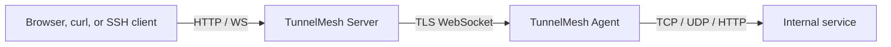

# Five-minute quick start

This guide starts a local SQLite Server and one Agent with Docker. It is for evaluation; production
deployments should use TLS, a reverse proxy, scoped policies, and secrets from a secret manager.

## What you will build



## Prerequisites

- Docker Engine with the Compose plugin
- A browser
- About 2 GB of free memory

## Diagnose a first-run problem

Each binary has a `doctor` command that validates its configuration without starting
long-lived tunnels. The Server also opens and pings its configured database; Agent and
Client call the Server's unauthenticated `/health/ready` endpoint with a five-second
timeout and never send the service token.

```sh
tunnelmesh-server --config server.yaml doctor
tunnelmesh-agent --config agent.yaml doctor
tunnelmesh-client --config client.yaml doctor
```

For the Linux/macOS installer, `--dry-run --version vX.Y.Z` prints the exact release
URLs and install paths without network access or writes. `--print-checksum --version
vX.Y.Z` downloads and verifies the archive checksum, prints it, and exits without
installing files.

## Start the Server with Docker

```sh
git clone https://github.com/nnworld/TunnelMesh.git
cd TunnelMesh
docker compose -f docker-compose.local.yml up -d --build server
```

The Server is published on host port `80`. Open `http://127.0.0.1/` after the container starts.

## Bootstrap the administrator

```sh
docker compose -f docker-compose.local.yml exec server /usr/local/bin/tunnelmesh admin bootstrap
```

Copy the one-time username and password from the command output, then sign in at `http://127.0.0.1/`.

If the credentials are lost, regenerate them:

```sh
docker compose -f docker-compose.local.yml exec server /usr/local/bin/tunnelmesh admin regenerate-credentials --confirm
```

## Create an Agent and scoped token

1. Open **Agents** and create an Agent.
2. Open **Tokens**.
3. Create an `agent` token bound to the new Agent.
4. Copy the token immediately; it is shown only once.

The Agent resource must exist before the token is created. The token owner must match the Agent owner.

## Start the Agent

Export the token and Agent ID, then start the Agent container:

```sh
export TUNNELMESH_AGENT_TOKEN='<agent-token>'
export TUNNELMESH_AGENT_ID='<agent-id>'
docker compose -f docker-compose.local.yml --profile agent up -d agent
```

The default Agent endpoint is `ws://server/ws/agent`.

## Test a local forward

1. In the admin console, create a `client` token.
2. Run the client container:

```sh
export TUNNELMESH_CLIENT_TOKEN='<client-token>'
docker compose -f docker-compose.local.yml --profile client run --rm \
  client forward tcp --listen 127.0.0.1:15432 \
  --agent "$TUNNELMESH_AGENT_ID" \
  --target-host <internal-host> \
  --target-port <internal-port>
```

3. Connect your application to `127.0.0.1:15432`.

## Production next steps

- Use HTTPS/WSS with a reverse proxy.
- Restrict `security.allowed_hosts` and `security.allowed_origins`.
- Store service tokens in a secret manager.
- Review the [Docker deployment](../deployment/docker.md), [Nginx guide](../deployment/nginx.md),
  and [security policy](../../SECURITY.md).
